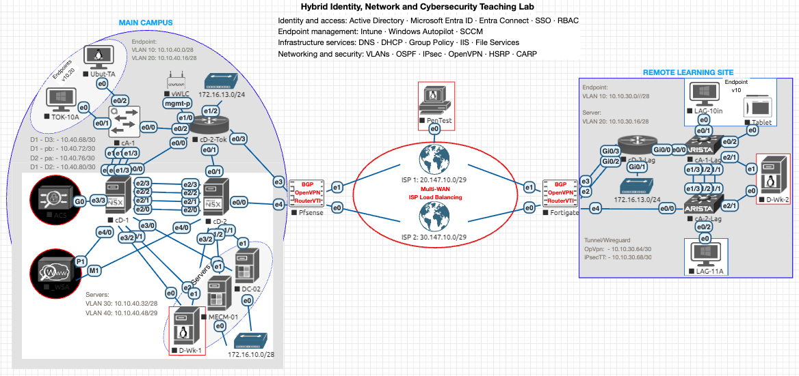

> This repository explores hybrid infrastructure and automation concepts that later informed [HybridOps](https://hybridops.tech/why).

# Windows Server and Network Administration with Automation

Built with: Windows Server • Active Directory • Entra ID • Intune • SCCM • Proxmox • EVE-NG

Hybrid Windows infrastructure lab combining on-premise server roles, cloud identity, device lifecycle automation and secure multi-site networking.

The environment covers hybrid identity, automated provisioning, endpoint management, server administration, monitoring and multi-site network design.

## Demo

> :arrow_forward: **Watch the video on YouTube**

Video link: [https://youtu.be/2B4VF5nqhFs?t=2](https://youtu.be/2B4VF5nqhFs?t=2)

Full demonstration playlist: [Project Demonstration Playlist](https://www.youtube.com/playlist?list=PLe-oTj2F_EnfoljrqXfTc3GbT5vtHFdWq)

## Architecture Overview

The lab environment integrates on-premise infrastructure with cloud management tools.

Key components include:

• Windows Server infrastructure with Active Directory  
• Hybrid identity using Microsoft Entra ID  
• Device lifecycle automation using Microsoft Intune and Windows Autopilot  
• Configuration management using System Center Configuration Manager (SCCM)  
• Multi-vendor networking with Cisco, Arista, and pfSense  

## Core Capabilities

### On-Premise Infrastructure

• Active Directory user and group management  
• Group Policy configuration and security enforcement  
• Server roles including DHCP, DNS, IIS, file services and print services  
• Failover clustering and load balancing for high availability  

### Device Lifecycle Management

• Automated device provisioning using Windows Autopilot  
• Centralised device management using Microsoft Intune  
• Application deployment and compliance enforcement  

### Identity and Access Management

• Hybrid identity architecture using Active Directory and Entra ID  
• Single Sign-On (SSO) integration  
• Role-based access control (RBAC)

### Networking and Security

• Multi-vendor switching using Cisco and Arista  
• Layer 2 and Layer 3 routing architectures  
• VLAN segmentation and DMZ design  
• Site-to-site connectivity using IPsec tunnels  
• Remote access using OpenVPN  

## Lab Environment

The infrastructure is deployed in a virtualised lab environment:

• Network simulations using **EVE-NG**  
• Infrastructure virtualised on **Proxmox**  
• Multi-site architecture with simulated failover scenarios  

The [EVE-NG lab export](examples/eve-ng/hybrid-identity-enterprise-lab.zip) provides the reusable topology and device configurations. Device images are not included.

## Automation and Monitoring

Automation and operational visibility include:

• PowerShell scripting for administrative automation  
• Configuration automation using Ansible  
• Monitoring using Zabbix  
• Network analysis using Wireshark  
